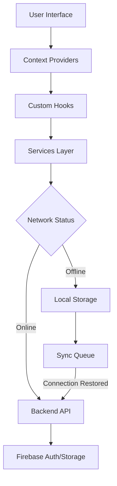
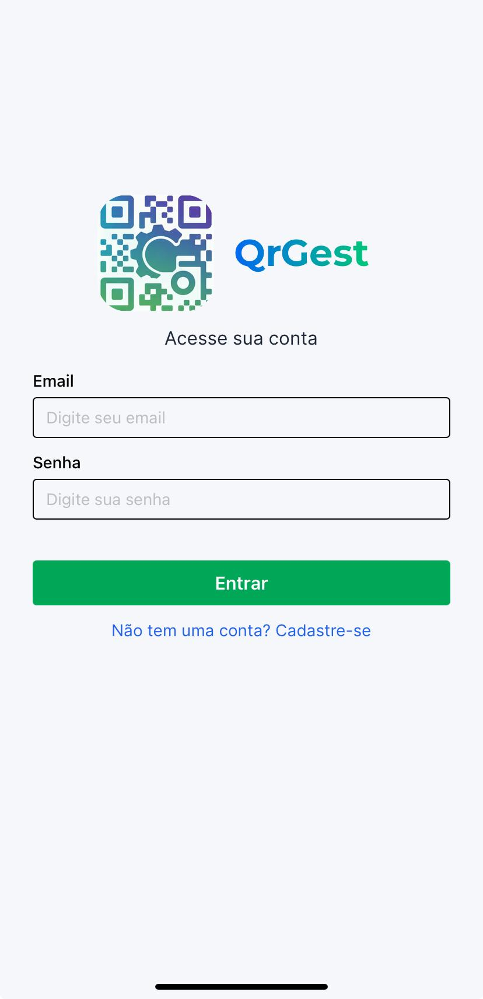
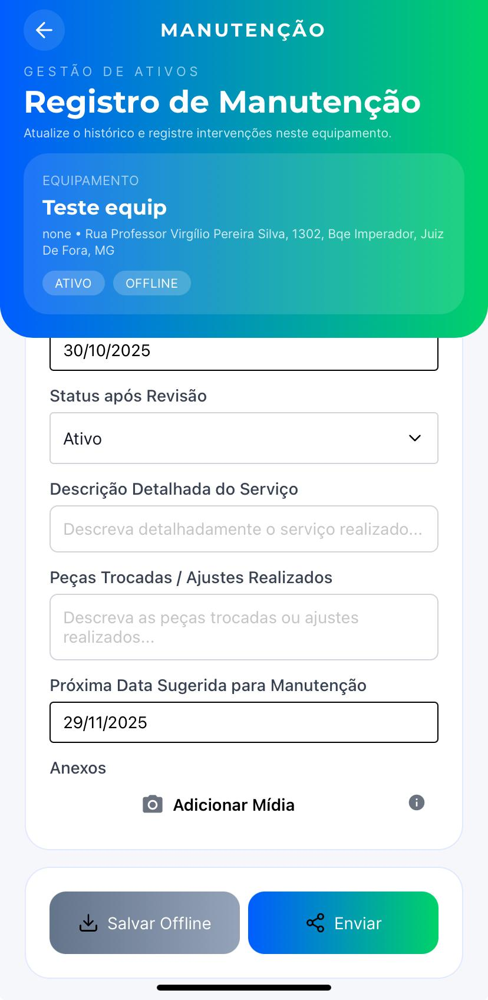
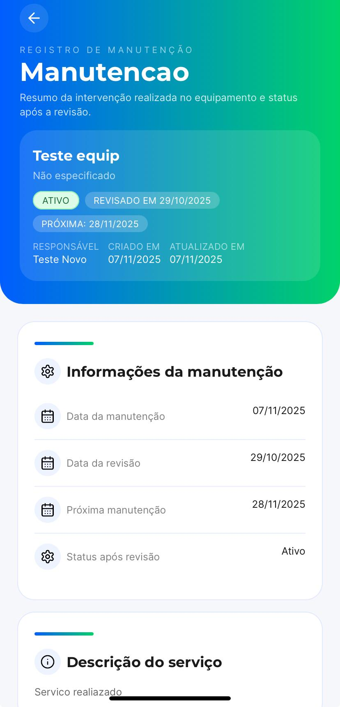
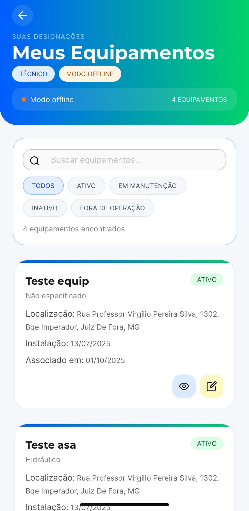

<div align="center">


# 📱 QRGest - Equipment Maintenance Management System

**A modern, offline-first mobile application for equipment maintenance management using QR Code technology**

[](https://reactnative.dev/)
[](https://expo.dev/)
[](https://www.typescriptlang.org/)
[](https://firebase.google.com/)

[Features](#-features) • [Getting Started](#-getting-started) • [Architecture](#-architecture) • [Technologies](#-technologies) • [Contributing](#-contributing)

</div>

---

## 📋 Overview

**QRGest** is a comprehensive equipment maintenance management system designed to streamline maintenance operations in organizations. Built with React Native and Expo, the application provides a seamless cross-platform experience for iOS, Android, and Web platforms.

The system leverages QR Code technology to quickly identify and access equipment information, enabling maintenance technicians to efficiently record inspections, track equipment status, and maintain detailed maintenance histories - even when working offline.

### 🎯 Key Objectives

- **Digitalize** maintenance workflows and eliminate paper-based processes
- **Centralize** equipment data and maintenance records in a single platform
- **Enable** offline-first operations for field technicians without internet connectivity
- **Streamline** equipment identification through QR Code scanning
- **Improve** maintenance traceability and reporting capabilities
- **Reduce** equipment downtime through proactive maintenance tracking

---

## ✨ Features

### 🔐 **User Management & Authentication**
- Secure authentication powered by Firebase Auth
- Role-based access control (Technicians, Managers, Administrators)
- User profile management with offline caching
- Automatic session management and token refresh

### 📦 **Equipment Management**
- Comprehensive equipment registration with custom fields per equipment type
- QR Code generation for each registered equipment
- Equipment categorization and status tracking (Active, Under Maintenance, Inactive)
- Location-based equipment tracking with GPS coordinates
- Support for dynamic equipment-specific fields
- Equipment search and filtering capabilities

### 🔧 **Maintenance Operations**
- Quick equipment access via QR Code scanning
- Detailed maintenance record creation with:
  - Service descriptions
  - Parts replaced
  - Status updates
  - Photo attachments
  - Next maintenance scheduling
- Comprehensive maintenance history per equipment
- Maintenance reports and analytics
- Technician assignment functionality

### 📴 **Offline-First Architecture**
- Full offline functionality for field operations
- Local data caching with AsyncStorage
- Automatic background synchronization when connectivity is restored
- Queue-based sync system for maintenance records
- Conflict resolution and retry mechanisms
- Visual indicators for sync status

### 📸 **Media Management**
- Photo capture directly from camera
- Image gallery selection
- Image compression and optimization
- Attachment viewer with zoom capabilities
- Cloud storage integration for uploaded media

### 📊 **Reporting & Analytics**
- Equipment maintenance history tracking
- Status reports and equipment health monitoring
- Export functionality for maintenance records
- Real-time sync status indicators

---

## 🚀 Getting Started

### Prerequisites

Before you begin, ensure you have the following installed:

- **Node.js** (v18 or higher)
- **npm** or **yarn**
- **Expo CLI**: `npm install -g expo-cli`
- **iOS Simulator** (macOS only) or **Android Studio** (for Android emulator)

### Installation

1. **Clone the repository**

```bash
git clone https://github.com/yourusername/qrgest.git
cd qrgest
```

2. **Install dependencies**

```bash
npm install
```

3. **Configure environment variables**

Create a `.env` file in the root directory based on `.env.example`:

```env
EXPO_PUBLIC_API_URL=your_backend_api_url
EXPO_PUBLIC_FIREBASE_API_KEY=your_firebase_api_key
EXPO_PUBLIC_FIREBASE_AUTH_DOMAIN=your_firebase_auth_domain
EXPO_PUBLIC_FIREBASE_PROJECT_ID=your_firebase_project_id
EXPO_PUBLIC_FIREBASE_STORAGE_BUCKET=your_firebase_storage_bucket
EXPO_PUBLIC_FIREBASE_MESSAGING_SENDER_ID=your_firebase_messaging_sender_id
EXPO_PUBLIC_FIREBASE_APP_ID=your_firebase_app_id
```

4. **Start the development server**

```bash
npm start
```

### Running the Application

After starting the development server, you can run the app on:

- **iOS Simulator**: Press `i` in the terminal
- **Android Emulator**: Press `a` in the terminal
- **Web Browser**: Press `w` in the terminal
- **Physical Device**: Scan the QR code with the Expo Go app

### Building for Production

```bash
# iOS
npm run ios

# Android
npm run android

# Web
npm run web
```

---

## 🏗️ Architecture

### Project Structure

```
qrgest/
├── app/                          # Application screens and navigation
│   ├── (tabs)/                   # Tab-based navigation screens
│   │   ├── index.tsx            # Home/Dashboard
│   │   ├── explore.tsx          # Equipment exploration
│   │   └── scan.tsx             # QR Code scanner
│   ├── equipment/               # Equipment-related screens
│   ├── login.tsx                # Authentication screen
│   ├── register.tsx             # User registration
│   └── _layout.tsx              # Root layout configuration
├── components/                   # Reusable React components
│   ├── ui/                      # UI component library (GlueStack UI)
│   ├── AttachmentManager.tsx   # File attachment handling
│   ├── AuthGuard.tsx           # Route protection
│   └── MaintenanceHistory.tsx  # Maintenance records display
├── services/                     # API and business logic
│   ├── auth.ts                 # Authentication services
│   ├── equipment.ts            # Equipment management services
│   ├── syncService.ts          # Offline synchronization
│   ├── offlineStorage.ts       # Local data persistence
│   └── image.ts                # Image handling and upload
├── contexts/                     # React Context providers
│   ├── AuthContext.tsx         # Authentication state management
│   └── SyncContext.tsx         # Synchronization state management
├── hooks/                        # Custom React hooks
│   ├── useAuth.ts              # Authentication hook
│   ├── useConnectivity.ts      # Network connectivity monitoring
│   └── useMaintenanceForm.ts   # Maintenance form logic
├── config/                       # Configuration files
│   ├── firebase.ts             # Firebase initialization
│   ├── apiUrl.ts               # API endpoint configuration
│   └── env.ts                  # Environment variables
└── utils/                        # Utility functions
    └── equipment.ts            # Equipment-related helpers
```

### Data Flow



### Key Design Patterns

- **Offline-First**: All operations work offline with automatic sync
- **Context API**: Global state management for auth and sync
- **Service Layer**: Separation of business logic from UI components
- **Queue-Based Sync**: Reliable synchronization with retry mechanisms
- **File-Based Routing**: Expo Router for declarative navigation

---

## 🛠️ Technologies

### Core Framework
- **React Native** (0.81) - Cross-platform mobile development
- **Expo** (54.0) - Development platform and build system
- **TypeScript** (5.9) - Type-safe development
- **Expo Router** (6.0) - File-based navigation

### UI & Styling
- **GlueStack UI** - Component library
- **NativeWind** (4.1) - Tailwind CSS for React Native
- **React Native Reanimated** - Smooth animations
- **React Native Gesture Handler** - Touch interactions

### Backend & Authentication
- **Firebase Auth** (11.8) - User authentication
- **Firebase Storage** - Cloud file storage
- **Axios** (1.10) - HTTP client

### Device Features
- **Expo Camera** - QR Code scanning and photo capture
- **Expo Location** - GPS coordinates for equipment
- **Expo Image Picker** - Gallery access
- **React Native QRCode SVG** - QR Code generation

### Data & State Management
- **AsyncStorage** - Local data persistence
- **React Context API** - Global state management
- **NetInfo** - Network connectivity monitoring

### Development Tools
- **ESLint** - Code linting
- **Metro** - JavaScript bundler

---

## 📱 App Screenshots

<div align="center">

| Login Screen | Equipment List | Maintenance Form |
|:---:|:---:|:---:|
|  |  |  |

| Equipment Details | Offline Mode |
|:---:|:---:|
|  |  |

</div>

---

## 🔧 Configuration

### Firebase Setup

1. Create a new Firebase project at [Firebase Console](https://console.firebase.google.com/)
2. Enable Authentication with Email/Password
3. Create a Firestore database
4. Add iOS/Android/Web apps to your Firebase project
5. Copy the configuration credentials to your `.env` file

### Backend API

The application requires a backend API for equipment and maintenance management. The API should implement the following endpoints:

- `POST /api/auth/register` - User registration
- `POST /api/auth/login` - User authentication
- `GET /api/equipment/` - List all equipment
- `POST /api/equipment/register` - Register new equipment
- `GET /api/equipment/:id` - Get equipment details
- `GET /api/equipment/available-equipments` - Get equipment models
- `POST /api/maintenance/` - Create maintenance record
- `GET /api/maintenance/equipment/:id` - Get equipment maintenance history
- `GET /api/maintenance/:id` - Get maintenance record details
- `POST /api/upload/images` - Upload images


You can se the project at: https://github.com/pedrobronzato/QrGest-API

---

## 🤝 Contributing

Contributions are welcome! Please follow these steps:

1. **Fork** the repository
2. **Create** a feature branch (`git checkout -b feature/AmazingFeature`)
3. **Commit** your changes (`git commit -m 'Add some AmazingFeature'`)
4. **Push** to the branch (`git push origin feature/AmazingFeature`)
5. **Open** a Pull Request
---

## 📄 License

This project is part of an academic thesis (TCC) by Pedro Hotz. All rights reserved.

---

## 👨‍💻 Author

**Pedro Hotz**

- GitHub: [@pedrohotz](https://github.com/pedrohotz)
- LinkedIn: [Pedro Hotz](https://www.linkedin.com/in/pedrohotz)
